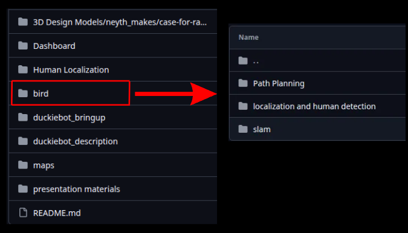

# Getting Started

This section explains how to set up the development environment and run the software on a real Duckiebot.

The project is organized into three main modules:

- **Perception** – responsible for detecting humans and processing visual information.
- **Localization** – responsible for robot localization using ArUco markers and SLAM.
- **Web Dashboard** – Receives data from the Duckiebot in real time and presents the robot's status and detection results through a user-friendly web interface.

Follow the instructions below to prepare your environment, deploy the code, and run each module.

# Perception

> Documentation for the perception module is currently under development and full version will be added soon.

## Camera Setup

Before running the perception module, both cameras must be mounted securely on the robot.

### Duckiebot Camera

- The Duckiebot camera should remain in its default mounting position.
- Make sure the camera is firmly attached and does not move during operation.
- If the camera position changes, a new camera calibration and homography calibration should be performed.

### Raspberry Pi NoIR Camera

- Mount the NoIR camera so that it observes approximately the same forward scene as the Duckiebot camera.
- Ensure the camera is rigidly fixed to prevent vibrations or movement.
- The camera orientation used in this project assumes a 180° rotation because it mounted reverse to do not cause damage to ribbon cable to RaspberryPI 3B, which is corrected in software.

---

## Camera Alignment

Accurate localization depends on proper camera alignment.

When installing the cameras:

- Align both cameras so they face forward.
- Minimize the horizontal offset between the two optical axes.
- Avoid changing the camera height or tilt after calibration.
- Ensure the ground plane is clearly visible in the lower portion of the image.

If any camera is repositioned, the following should be recalculated:

- Camera calibration parameters.
- Homography matrix.
- Region of Interest (ROI), if necessary.

---

## Running the Perception Module

Before running the perception system:

1. Start the Duckiebot and ensure ROS is running.
2. Verify that the Duckiebot camera is publishing images.
3. Start the Raspberry Pi camera stream by connecting the Raspberry Pi by SSH.
4. Start the stream by hand in PI console with [rpicam-vid](https://www.raspberrypi.com/documentation/computers/camera_software.html) commands via using TCP port.
5. Update the IP addresses in the configuration files if required.
6. Verify that the model weights are downloaded and the correct path is specified.

Run the perception module:

```bash
python detection.py
```
> Path in the work looks well in standalone but at full packaging with other modules like navigation,localization,dead reckoning etc. you may have to handle it.

The system will:

- Connect to both cameras.
- Process incoming frames.
- Detect people in real time.
- Estimate the distance using planar homography and viewing angle of each detection.
- Publish the detection results through ROS.
- Display the processed camera streams and boxes.

---

## Configuration

Before running the project, verify the following configuration files:

- `duckie_config.py` – Duckiebot WebSocket address and camera topic.
- `pi_camera_config.py` – Raspberry Pi TCP video stream address.
- `ros_config.py` – ROS bridge WebSocket address.
- `camera_controls.json` – Image processing parameters.
- `duckie_calibration.py` – Camera intrinsic parameters and distortion coefficients.

These files should be updated to match your hardware and network configuration.

---

## Calibration Notes

For reliable localization:

- Perform camera calibration at the same resolution used during inference.
- Compute the homography matrix after the camera has been mounted.
- Avoid changing the camera position after calibration.
- Recalibrate if the camera mount, height, or viewing angle changes.

Proper calibration significantly improves distance estimation accuracy.

# Localization
Before running the project on a real Duckiebot, make sure your development environment is properly configured.

## Prerequisites

Complete the official Duckietown laptop setup guide before proceeding:

https://docs.duckietown.com/daffy/opmanual-duckiebot/setup/setup_laptop/index.html

This guide covers all required software installations and the initial configuration needed to communicate with the Duckiebot.

---

## Network Configuration

You can connect to the Duckiebot either through **Ethernet** or **Wi-Fi**.

> **Note:** The first-time network configuration must be performed over an Ethernet connection. Afterward, you can configure and use Wi-Fi.

Due to network encryption limitations, public wireless networks (such as **Hacettepe University Wi-Fi** or **eduroam**) are not supported. If you would like to use the Duckiebot wirelessly, we recommend connecting it through a **mobile hotspot**.

For a detailed networking guide, refer to:

https://github.com/awwad-hamza/Duckiebot-DB21M-Post-build-Setup?tab=readme-ov-file#networking

---

## Basic Duckiebot Operations

Before developing your own applications, it is recommended that you become familiar with the basic Duckiebot workflow and the tools provided by the Duckietown Software Stack (DTS).

The official operations guide explains how to handle the Duckiebot and use its built-in functionalities:

https://docs.duckietown.com/daffy/opmanual-duckiebot/operations/handling/db21.html

---

## Developing Your Own Application

Once you have completed the setup steps above, you are ready to build, run, and deploy your own software on the Duckiebot.

For this project, we used the official Duckietown ROS project template as the foundation of our implementation. We highly recommend starting with the same template:

https://docs.duckietown.com/daffy/devmanual-software/beginner/ros/create-new-ros-project.html

After creating the project, the directories you will work with most frequently are:

- `projects/`
- `launchers/`

During development, your source code and launch configurations will be placed inside these directories. You can then build and run your application using Docker to execute your code directly on the Duckiebot.

---

## Creating Your First ROS Package

Before using this repository, create a Catkin package by following the official Duckietown tutorial:

https://docs.duckietown.com/daffy/devmanual-software/beginner/ros/catkin-packages.html

If you are new to ROS development, we also recommend completing the following tutorials to get familiar with the development workflow.

### ROS Publisher

https://docs.duckietown.com/daffy/devmanual-software/beginner/ros/ros-publisher.html

### ROS Subscriber

https://docs.duckietown.com/daffy/devmanual-software/beginner/ros/ros-subscriber.html

After successfully completing these tutorials, you will be ready to use the code provided in this repository.

## Project Structure

The implementation used in our project is located inside the `bird/` directory.

<p align="center">
  
</p>

The directory contains three independent modules:

- Localization and Human Detection
- SLAM
- Path Planning

Each module is described below.

---

## Localization and Human Detection

This module performs robot localization using known ArUco markers while simultaneously detecting humans.

### `localizer_aruco_node.py`

This node estimates the robot's pose whenever a **known ArUco marker** is detected. The estimated pose is then published to a ROS topic for use by other nodes.

### `odometry_node.py`

This node combines localization from ArUco markers with wheel odometry.

- If a known ArUco marker is visible, the robot pose is updated using the pose published by `localizer_aruco_node.py`.
- If no marker is detected, the pose is updated using odometry data.

This approach allows the robot to maintain a continuous pose estimate even when visual landmarks are temporarily unavailable.

### `visualizer_node.py`

This node visualizes the entire localization process in **RViz**.

The visualization includes:

- A **red circle** representing the robot.
- The robot's field of view:
  - **Green** when a human is detected.
  - **Red** when no human is detected.
- **Green squares** representing known ArUco markers.
- The left camera view showing real-time ArUco marker detections.

### `design_project.sh`

Launches all nodes required for the Localization and Human Detection module from a single launcher script.

---

## SLAM

Unlike the previous module, this implementation assumes that the locations of the ArUco markers are **unknown**.

### `mapping.py`

This node estimates and stores the positions of previously unseen ArUco markers using the robot's current pose.

Whenever a marker that has already been mapped is detected again, the robot updates its own pose using the stored marker position.

### `odometry_node.py`

This node fuses mapping results with odometry.

- If a previously mapped ArUco marker is detected, the robot updates its pose using the pose published by `mapping.py`.
- Otherwise, the pose is updated using wheel odometry.

### `mapping_vis_angle.py`

This node visualizes the complete SLAM process in **RViz**.

In addition to the robot and mapped ArUco markers, detected humans are also displayed on the generated map.

---

## Path Planning

The code inside the **Path Planning** directory is an independent experimental implementation and is not part of the final project.

Its purpose is to enable autonomous navigation from one location to another while avoiding obstacles.

Since this module remained unfinished during the experimental phase of the project, it is not included in the remainder of this documentation.

# Running the Project

Download the contents of the following directory from this repository:

```
RescueRobot/bird/localization and human detection/
```

## 1. Update the Robot Name

If you are using a Duckiebot with a name other than **bird**, replace every occurrence of `bird` in the source code with your robot's hostname using your editor's **Find and Replace** feature.

If your robot is already named `bird`, no changes are required.

---

## 2. Copy the Project Files

Copy all Python files from the `localization and human detection` directory into the Catkin package you created earlier under the `packages/` directory.

Next, copy the `.sh` launcher script into the `launchers/` directory.

Your project structure should look similar to:

```text
packages/
└── my_package/
    ├── localizer_aruco_node.py
    ├── odometry_node.py
    └── visualizer_node.py

launchers/
└── design_project.sh
```

---

## 3. Make the Files Executable

All Python scripts and launcher scripts must be executable before they can be launched.

Example:

```bash
chmod +x launchers/design_project.sh

chmod +x packages/my_package/localizer_aruco_node.py
chmod +x packages/my_package/odometry_node.py
chmod +x packages/my_package/visualizer_node.py
```

Keeping multiple Python nodes and launcher scripts inside these directories allows you to easily switch between different projects. Each launcher script specifies which Python nodes should be executed.

---

## 4. Navigate to Your Catkin Package

Example:

```bash
cd my_package
```

---

## 5. Build and Run on Your Development Computer

Because the Duckiebot has limited computational resources, we developed and tested the project by building and running it on the development computer instead of building and running on the Duckiebot.

Build the project:

```bash
dts devel build -f
```

Run the launcher:

```bash
dts devel run -R <ROBOT_NAME> -L <LAUNCHER_NAME>
```

Example:

```bash
dts devel run -R bird -L design_project
```

> **Note:** Do not include the `.sh` extension when specifying the launcher name.

---

## 6. Build and Run Directly on the Duckiebot

Because the Duckiebot has limited computational resources, we developed and tested the project by building and running it on the development computer instead of building and running directly on the Duckiebot.

Build:

```bash
dts devel build -H bird -f
```

Run:

```bash
dts devel run -H <ROBOT_NAME> -L <LAUNCHER_NAME>
```

Example:

```bash
dts devel run -H bird -L design_project
```

> **Note:** Do not include the `.sh` extension when specifying the launcher name.

---

## Important Notes

- Whenever you add a new Python or launcher file, make it executable **and rebuild** the project.
- Whenever you modify the source code, rebuild the project before running it again.

---

## Controlling the Robot

You can control the Duckiebot using the keyboard:

```bash
dts duckiebot keyboard_control <ROBOT_NAME>
```

Example:

```bash
dts duckiebot keyboard_control bird
```

---

## Stopping the Wheels

In some cases, the wheels may continue spinning after the program exits. You can manually stop them by publishing zero velocities.

Start the GUI tools:

```bash
dts start_gui_tools bird
```

Then publish zero wheel velocities:

```bash
rostopic pub /bird/wheels_driver_node/wheels_cmd \
duckietown_msgs/WheelsCmdStamped "header:
  stamp: now
vel_left: 0.0
vel_right: 0.0"
```

---

## Visualization

Start the GUI tools:

```bash
dts start_gui_tools <ROBOT_NAME>
```

Example:

```bash
dts start_gui_tools bird
```

Launch the image viewer:

```bash
rqt_image_view
```

In the topic selection box, subscribe to the visualization topic published by `visualizer_node.py`.

Example:

```text
/bird/live_visualization/compressed
```
## Running the SLAM Module

To run the SLAM implementation, download the files from:

```text
RescueRobot/bird/slam/
```

Then follow the **same setup and execution steps** described above:

1. Replace the robot name (`bird`) if necessary.
2. Copy the Python files into your Catkin package.
3. Copy the corresponding launcher script into the `launchers/` directory.
4. Make all Python and launcher scripts executable.
5. Build the project.
6. Run the launcher using the appropriate DTS command.

The execution procedure is identical to the **Localization and Human Detection** module.

# Web Dashboard
